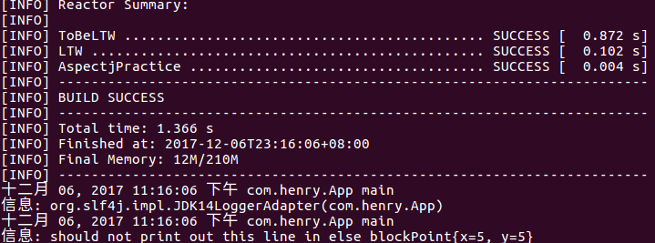
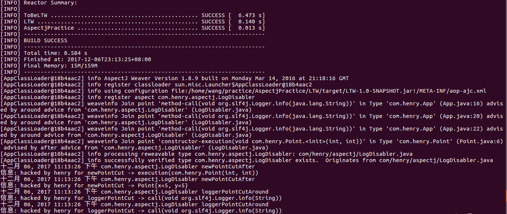
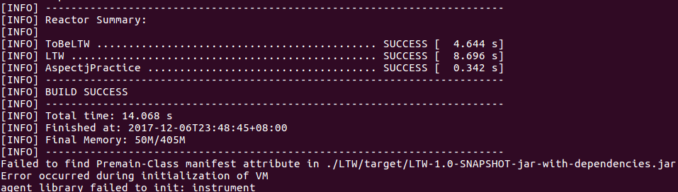
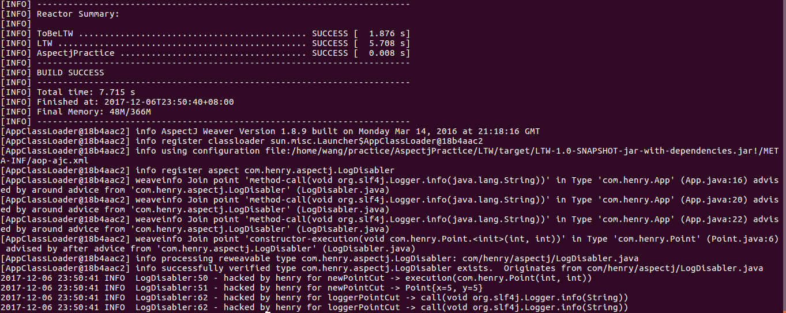

# 背景

最近客户现场报：一服务进程偶尔出现不停刷错误日志，导致CPU占用率居高不下。从JAVA调用堆栈初步判断是一年久失修的第三方jar包中抛出了异常。GOOGLE一番之后，发现是一已知问题，只能升级jar包。可问题就出在这儿，届于系统的古老复杂架构，许多jar版本根本升不上去。

思忖一番之后，想到两个方案：
>１．移植对该问题的修复代码到当前版本，可能需要适当的修改。
>２．关闭该错误日志的输出。

经过综合评估，个人倾向第二种方案，于是就写了这个POC。

# 用的哪个Logger？
该jar包经过了内部的多次封装，提供方法返回`org.slf4j.Logger`。但鉴于该jar包代码的复杂性，可读性及系统中引入的多个`org.slf4j.Logger`的具体实现（log4j，jdk等），使问题更加扑朔迷离。因此首要任务是如何打印出这个`org.slf4j.Logger`运行时的具体实现。

# 如何知道`org.slf4j.Logger`的运行时实现？
于是问题转化为：在不修改出问题jar源代码的基础上打印出该`org.slf4j.Logger`对象。通过Aspectj 的LTW（Load-Time Weaving）在类加载的时候植入字节码，可以很好的解决这个问题。

# 标准方式

## 为啥不是想要的结果？
**没加-javaagent启动参数**
```bash
mvn clean install -DskipTests && mvn dependency:copy-dependencies && mv ./LTW/target/dependency/slf4j-log4j12-1.7.6.jar ./LTW/target/ && java -cp .:./LTW/target/LTW-1.0-SNAPSHOT.jar:./LTW/target/dependency/* com.henry.App
```
___


## 得到预期结果
**加上-javaagent启动参数**
```bash
mvn clean install -DskipTests && mvn dependency:copy-dependencies && mv ./LTW/target/dependency/slf4j-log4j12-1.7.6.jar ./LTW/target/ && java -javaagent:./LTW/target/dependency/aspectjweaver-1.8.9.jar -cp .:./LTW/target/LTW-1.0-SNAPSHOT.jar:./LTW/target/dependency/* com.henry.App
```
___



# Fat jar方式

## 为啥不是想要的结果？
**MANIFEST.MF被覆盖**
```bash
mvn clean install -DskipTests && java -javaagent:./LTW/target/LTW-1.0-SNAPSHOT-jar-with-dependencies.jar -jar ./LTW/target/LTW-1.0-SNAPSHOT-jar-with-dependencies.jar
```
___


> 其实Fat jar很容易出错，经常遇到的问题是同一个文件会出现覆盖。
> 请留意LTW/pom.xml中Fat jar will [not] work部分配置。
> 为了说明问题，源代码有意用Fat jar will not work部分配置。

## 得到预期结果
**指定MANIFEST.MF**
```bash
mvn clean install -DskipTests && java -javaagent:./LTW/target/LTW-1.0-SNAPSHOT-jar-with-dependencies.jar -jar ./LTW/target/LTW-1.0-SNAPSHOT-jar-with-dependencies.jar
```
___

> 请留意LTW/pom.xml中Fat jar will [not] work部分配置。
> 为了得到预期结果，请使用Fat jar will work部分配置。
